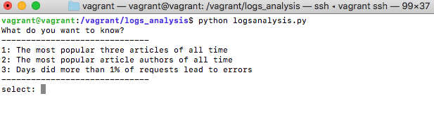

# Logs Analysis

## Overview
This is a program for analyzing log data of certain web site.  

## Features
It generates text file that have information of below.
* "The most popular three articles of all time"
* "The most popular article authors of all time"
* "Days did more than 1% of requests lead to errors"

[Generated text file(sample)]('report.txt')

## Requirement
* Python 3
* PostgreSQL

## How to Use
1. In the command line, switch to `logs_analysis/` directory.
2. Run: `python logsanalysis.py`, then it starts up.
3. Select from options with numbers, and input number.

## License
This project is licensed under the MIT License.
